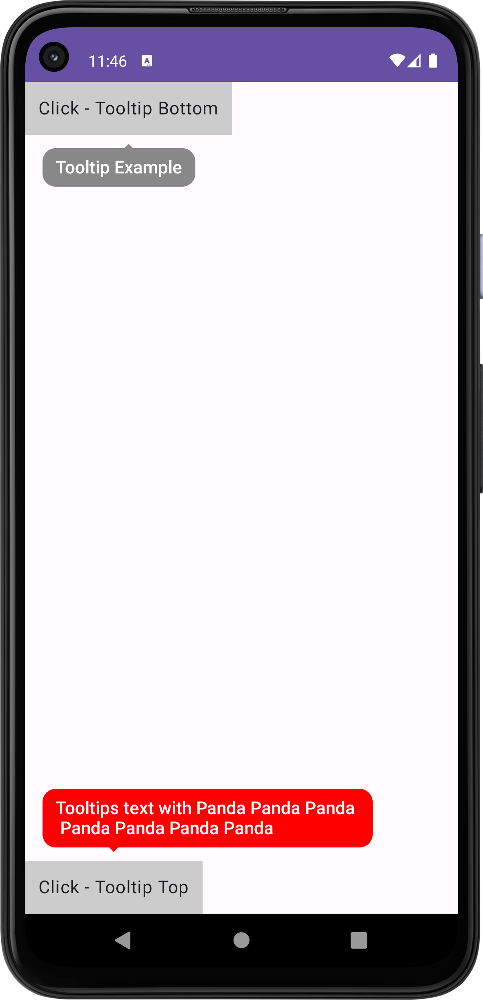

<p align="center">
  
  
  
</p>

<p align="center">
  <a href="https://mailchi.mp/kotlinweekly/kotlin-weekly-389"></a>
  
  
</p>

## PandaTooltip | Customizable Tooltips
Customizable Tooltips Android Jetpack Compose

<p align="start">
 
</p>

## Usage
```kotlin
  var pandaState by remember { mutableStateOf(false) }

 Panda(modifier = Modifier,
       pandaState = pandaState,
       backgroundColor = Color.Gray,
       content = {modifier -> Text(modifier = modifier.background(Color.LightGray).padding(12.dp),
            text = "Click - Tooltip Bottom")},
       tooltipContent = {
            Text(modifier = Modifier.padding(horizontal = 12.dp)
                      .padding(vertical = 8.dp),
                 text = "Tooltip Example",
                 style = TextStyle(
                              fontSize = 16.sp,
                              lineHeight = 18.sp,
                              fontWeight = FontWeight.Medium,
                              color = Color.White)
                         )
        },
        onDismissRequest = {pandaState = it}
)

```

## Customize
```python
  modifier -> Arrange your view
  pandaState -> Show tooltip
  backgroundColor -> Tooltip background color
  content -> The item where the tooltip will appear
  tooltipContent -> Tooltip content
  onDismissRequest -> Tooltip hide action
```

## Download
> Latest Version : 1.0.6
> material3 is required.
<details>
  <summary>Groovy</summary>

  ## settings.gradle
  ```gradle
  maven { url 'https://jitpack.io' }
  ```
  ## build.gradle
  ```gradle
  implementation 'androidx.compose.material3:material3:1.1.0'
  implementation 'com.github.ridvanozcan:PandaTooltip:<latest-version>'
  ```
</details>

<details>
  <summary>Kotlin DSL</summary>

  ## settings.gradle
  ```gradle
  maven(url = "https://jitpack.io")
  ```
  ## build.gradle
  ```gradle
  implementation("androidx.compose.material3:material3:1.1.0")
  implementation("com.github.ridvanozcan:PandaTooltip:<latest-version>")
  ```
</details>

<div align="start"> <h2 align="start">License</h1> </div>

``` xml

Copyright 2023 ridvanozcan.

Licensed under the Apache License, Version 2.0 (the "License");
you may not use this file except in compliance with the License.
You may obtain a copy of the License at

   http://www.apache.org/licenses/LICENSE-2.0

Unless required by applicable law or agreed to in writing, software
distributed under the License is distributed on an "AS IS" BASIS,
WITHOUT WARRANTIES OR CONDITIONS OF ANY KIND, either express or implied.
See the License for the specific language governing permissions and
limitations under the License.
